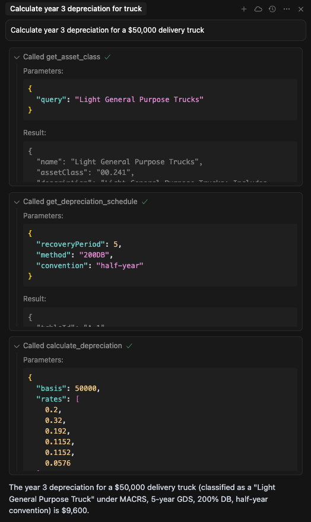

# Tax Depreciation MCP Guide

A guide and example queries for interacting with the Tax Depreciation MCP server based on MACRS from IRS publication 946.

## Remote MCP Endpoint

The remote MCP is hosted at:

```
https://tax-depreciation-mcp.onrender.com/mcp
```

## Available Tools

The following tools are available via the Tax Depreciation MCP endpoint. All are based on the MACRS from IRS Publication 946:

- `get_asset_class`: Retrieve the asset class information for a given asset.
- `get_depreciation_schedule`: Get the full MACRS depreciation schedule for an asset.
- `calculate_depreciation_amount`: Calculate the depreciation amount for a specific year and asset.
- `choose_convention`: Determine the applicable convention (half-year, mid-quarter, etc.) for an asset.
- `ping`: Test connectivity to the MCP endpoint.

## Usage

### Add to Cursor

If you are using a tool or extension that supports MCP queries (such as the Model Context Protocol extension in VS Code), you can add the endpoint to your cursor by:

1. Opening the command palette (usually `Cmd+Shift+P` on macOS).
2. Typing `MCP: Add Endpoint to Cursor` and selecting it.
3. Entering the endpoint URL:
   ```
   https://tax-depreciation-mcp.onrender.com/mcp
   ```
4. Now, you can type your query in the editor and run it directly against the MCP endpoint.

Alternatively, you can manually add the endpoint to your tool's configuration if required.

```json
{
    "mcpServers": {
        "tax-depreciation-mcp": {
            "url": "https://tax-depreciation-mcp.onrender.com/mcp"
        }
    }
}
```

## Example Queries

You can try queries like:

- **Calculate year 3 depreciation for a $50,000 delivery truck**
- **Get class info for computers**



These queries can be sent to the MCP endpoint to retrieve tax depreciation calculations and class information for various assets.

## About MCP

The Model Context Protocol (MCP) is a standard for querying and interacting with financial and tax models via a consistent API.

---

For more information, see the [MCP documentation](https://modelcontext.org/).
